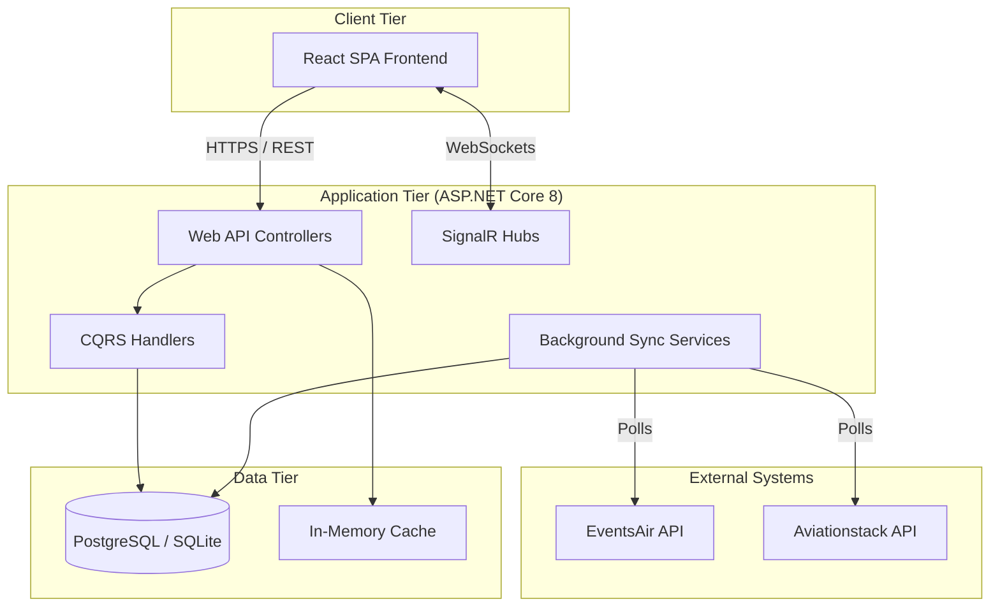

# IsDB Annual Meetings Hospitality System: Technical Handover Package

## 1. Executive Summary

### 1.1 Purpose of the System
The IsDB Annual Meetings Hospitality System is a comprehensive, real-time logistics and guest management platform designed to orchestrate the end-to-end journey of VIPs, delegates, and officials attending the Islamic Development Bank's Annual Meetings. It bridges the gap between registration data (sourced from EventsAir) and on-the-ground operational execution (airport reception, fleet management, and hotel coordination).

### 1.2 Main Business Processes
- **Guest Synchronization:** Automated, continuous ingestion of guest profiles, registration types, marketing tags, and travel itineraries from the EventsAir platform.
- **Inbound Journey Tracking:** Orchestrating the guest experience from airport arrival (`Arrived`), to embassy reception (`ReceivedByEmbassyTeam`), vehicle assignment (`VehicleAssigned`), and finally hotel check-in (`AtHotel`).
- **Fleet & Transport Management:** Managing a pool of vehicles, drivers, and car classes. Includes rule-based auto-assignment of car classes based on registration types and real-time dispatching of vehicles to arriving guests.
- **Flight Tracking:** Real-time integration with the Aviationstack API to monitor flight statuses, actual arrival times, and delays, ensuring transport teams are dispatched accurately.
- **Outbound Journey Management:** Handling departure requests via a public-facing portal, allowing guests to book shuttles, which are then managed by the transport team.
- **Cross-Team Communication:** A role-based notification system that broadcasts critical events (e.g., VIP arrivals, flight delays) across Airport, Transport, Hotel, Liaison, and Control Room teams.

### 1.3 Key Features
- **Real-Time Dashboards:** Role-specific dashboards (Airport, Transport, Hotel, Control Room, Liaison) providing live operational overviews.
- **Automated Sync & Alerting:** Background services that poll EventsAir and Aviationstack, coupled with a `SyncAlert` system that flags data anomalies (e.g., car class mismatches, missing flights) for human review.
- **Dynamic Access Control:** JWT-based authentication with granular role-based access control (RBAC) ensuring data privacy and operational separation of duties.
- **Placard Generation:** Automated generation of welcome placards for arriving guests, complete with customizable event logos.
- **Audit & History Tracking:** Comprehensive logging of guest status changes, vehicle assignments, and system errors for post-event analysis.

---

## 2. System Architecture Document

### 2.1 High-Level Architecture Diagram


### 2.2 Detailed Component Architecture
The system is built using a **Clean Architecture** approach, ensuring separation of concerns across four distinct layers:
1. **Domain Layer:** Contains enterprise logic, entities (`Guest`, `Vehicle`, `Flight`), enums (`GuestStatus`, `UserRole`), and common interfaces.
2. **Application Layer:** Contains business logic, DTOs, CQRS commands/queries (using MediatR), and validation rules (FluentValidation).
3. **Infrastructure Layer:** Handles external concerns including data access (Entity Framework Core), external API clients (EventsAir, Aviationstack), background services, and JWT token generation.
4. **API Layer (Presentation):** ASP.NET Core Web API controllers, SignalR hubs, middleware (global exception handling), and configuration wiring.

### 2.3 Frontend Architecture
- **Framework:** React 18 with TypeScript, bootstrapped via Vite.
- **State Management:** Zustand for global state (e.g., Auth, UI toggles) and React Query (TanStack Query) for server state caching, fetching, and mutations.
- **Routing:** React Router DOM v6 with a `ProtectedRoute` wrapper enforcing role-based access.
- **Styling:** Tailwind CSS with Lucide React for iconography.
- **Structure:** Feature-based folder structure (`/pages/airport`, `/pages/fleet`, etc.) with shared `/components` and centralized `/api/client.ts` for Axios interceptors.

### 2.4 Backend Architecture
- **Framework:** .NET 8 ASP.NET Core Web API.
- **Pattern:** CQRS (Command Query Responsibility Segregation) implemented via MediatR.
- **Real-time:** SignalR is used to push flight status updates and notifications to connected clients.
- **Background Processing:** `IHostedService` implementations run continuously for EventsAir sync (`EventsAirSyncService`), flight tracking (`FlightTrackerSyncService`), and log retention (`LogRetentionService`).

### 2.5 Database Architecture
- **ORM:** Entity Framework Core 8.
- **Providers:** Configured to use Npgsql (PostgreSQL) in production (Railway) and SQLite for local development.
- **Schema:** Highly normalized schema with explicit foreign key constraints and cascade delete rules where appropriate.
- **Performance:** Strategic indexes on highly queried fields (e.g., `EventsAirContactId`, `Status`, `ScheduledArrival`).

### 2.6 Authentication and Authorization Flow
1. **Login:** User submits credentials to `/api/auth/login`.
2. **Validation:** System verifies BCrypt password hash.
3. **Token Generation:** `JwtService` generates an access token (containing `ClaimTypes.Role`) and a refresh token.
4. **Request Interception:** Frontend Axios interceptor attaches the Bearer token to all outbound requests.
5. **API Authorization:** Controllers use `[Authorize(Roles = "...")]` attributes.
6. **Active Check:** A global `ActiveUserFilter` verifies the user hasn't been deactivated mid-session, using a short-lived in-memory cache to minimize DB hits.

### 2.7 External Integrations
- **EventsAir:** The primary source of truth for guest registrations, travel itineraries, and marketing tags. Synced via a scheduled background worker using OAuth2 Client Credentials flow.
- **Aviationstack:** Provides real-time flight tracking data (actual arrival times, delays, terminals). Polled periodically for flights arriving within a configurable time window.

### 2.8 Deployment Architecture
- **Platform:** Railway (PaaS).
- **Containerization:** Multi-stage Dockerfile building the .NET application and serving the React SPA as static files via `app.UseDefaultFiles()` and `app.UseStaticFiles()`.
- **Database Provisioning:** Railway PostgreSQL plugin.
- **Environment Variables:** Configuration is injected via Railway variables (e.g., `DATABASE_URL`, `Jwt__Key`), overriding `appsettings.json`.

---

## 3. Technical Design Document

### 3.1 Technology Stack and Versions
- **Backend:** .NET 8.0, C# 12
- **Frontend:** React 18.2.0, TypeScript 5.2.2, Vite 5.0.11
- **Database:** PostgreSQL (Production), SQLite (Local Dev)
- **ORM:** Entity Framework Core 8.0.0
- **Libraries:** MediatR 12.4.1, AutoMapper 13.0.1, FluentValidation 11.11.0, Serilog 8.0.3, BCrypt.Net-Next 4.0.3, React Query 5.17.19, TailwindCSS 3.4.1

### 3.2 Design Patterns Used
- **Clean Architecture:** Strict dependency rule pointing inwards toward the Domain.
- **CQRS:** Separating read operations (Queries) from write operations (Commands).
- **Repository Pattern:** Abstracted via EF Core's `DbContext` and `DbSet`.
- **Options Pattern:** Strongly typed configuration binding (e.g., `EventsAirOptions`, `AviationstackOptions`).
- **Decorator/Middleware Pattern:** Global exception handling and Active User filtering.

### 3.3 Major Modules and Responsibilities
- **Guest Management:** Handles guest profiles, registration types, and journey status tracking.
- **Fleet Management:** Manages vehicles, drivers, car classes, and guest-to-vehicle assignments.
- **Flight Management:** Normalizes flight numbers, tracks schedules, and updates real-time statuses.
- **Sync & Alerts:** Orchestrates data ingestion from external APIs and generates actionable alerts for data discrepancies.
- **Notifications:** Role-based internal messaging system with read-receipt tracking.

### 3.4 Data Flow Diagrams
*(Note: Mermaid diagrams will be generated in Section 10)*
The primary data flow involves the `EventsAirSyncService` polling the external API, mapping JSON responses to Domain entities, and applying a multi-pass sync logic (Upsert Guests -> Deactivate Missing -> Sync Travel -> Detect Anomalies). Changes are persisted to the DB and broadcasted to the frontend via SignalR.

### 3.5 Error Handling Strategy
- **Backend:** A `GlobalExceptionMiddleware` catches unhandled exceptions, logs them to the `SystemLogs` table via `ISystemLogService`, and returns a standardized JSON error response.
- **Frontend:** Axios interceptors handle 401 Unauthorized responses by clearing local storage and redirecting to the login page. React Query handles query retries and error state rendering.
- **External APIs:** Polly retry policies are configured for both EventsAir and Aviationstack clients to handle transient network failures gracefully.

### 3.6 Logging and Monitoring Approach
- **Structured Logging:** Serilog is configured to enrich logs with context and output to the console (captured by Railway logs).
- **Persistent Logging:** Critical system events, sync results, and unhandled exceptions are written to the `SystemLogs` database table for admin review within the application UI.
- **Log Retention:** A background `LogRetentionService` automatically purges logs older than 30 days to manage database size.

---

## 4. Codebase Documentation

### 4.1 Complete Project Structure
```text
AnnualMeetingsRepo/
├── src/
│   ├── IsDB.Hospitality.API/              # Presentation Layer (Controllers, Hubs, Middlewares)
│   │   ├── ClientApp/                     # React Frontend (deprecated location)
│   │   └── wwwroot/                       # Static files output
│   ├── IsDB.Hospitality.Application/      # Business Logic (MediatR Handlers, DTOs, Interfaces)
│   ├── IsDB.Hospitality.Domain/           # Enterprise Entities, Enums, Exceptions
│   └── IsDB.Hospitality.Infrastructure/   # EF Core, External Clients, Background Services
├── frontend/                              # Active React SPA source code
│   ├── src/
│   │   ├── api/                           # Axios client and service wrappers
│   │   ├── components/                    # Reusable UI components
│   │   ├── pages/                         # Route-level page components
│   │   └── store/                         # Zustand state stores
│   ├── package.json
│   └── vite.config.ts
├── Dockerfile                             # Multi-stage build definition
└── IsDB.Hospitality.sln                   # .NET Solution file
```

### 4.2 Explanation of Major Folders and Modules
- **`IsDB.Hospitality.Domain/Entities`**: Contains the core data models (`Guest`, `Vehicle`, `Flight`, `SyncAlert`, etc.).
- **`IsDB.Hospitality.Application/Features`**: Organized by feature (e.g., `Guests`, `Vehicles`). Each feature folder contains `Commands` and `Queries` following the CQRS pattern.
- **`IsDB.Hospitality.Infrastructure/BackgroundServices`**: Houses the `IHostedService` implementations responsible for automated syncing and log cleanup.
- **`IsDB.Hospitality.Infrastructure/Persistence`**: Contains the EF Core `AppDbContext`, entity configurations, migrations, and database seeding logic.
- **`frontend/src/pages`**: Contains the React components that map directly to application routes, organized by operational module (e.g., `airport`, `hotel`, `transport`).

### 4.3 Dependency Inventory
**Backend Key Dependencies:**
- `Microsoft.EntityFrameworkCore` (8.0.0)
- `MediatR` (12.4.1)
- `AutoMapper` (13.0.1)
- `FluentValidation` (11.11.0)
- `Polly` (8.5.2)
- `BCrypt.Net-Next` (4.0.3)

**Frontend Key Dependencies:**
- `react` (18.2.0)
- `react-router-dom` (6.21.3)
- `@tanstack/react-query` (5.17.19)
- `zustand` (4.4.7)
- `axios` (1.6.5)
- `tailwindcss` (3.4.1)

### 4.4 Environment Variables and Configuration Documentation
Configuration is primarily managed via `appsettings.json`, overridden by environment variables in Railway:
- `DATABASE_URL`: Connection string for PostgreSQL.
- `Jwt__Key`: Secret key for signing JWT tokens.
- `Jwt__Issuer` / `Jwt__Audience`: JWT validation parameters.
- `EventsAir__ClientId` / `EventsAir__ClientSecret`: Credentials for EventsAir API.
- `Aviationstack__ApiKey`: API key for flight tracking (can also be configured via the DB).
- `PORT`: Injected by Railway to specify the listening port.

### 4.5 Build and Deployment Process
1. **Build:** The multi-stage `Dockerfile` restores NuGet packages, builds the .NET solution, and publishes the API project. The React frontend is built separately (via Vite) and its output is placed in the API's `wwwroot` folder.
2. **Deployment:** Railway detects the `Dockerfile` and builds the container. The `railway.json` configuration defines the health check path (`/api/health`) and restart policies.
3. **Database:** Migrations are applied automatically on application startup within `Program.cs`. Production seed data is applied idempotently using `production_seed.sql`.
