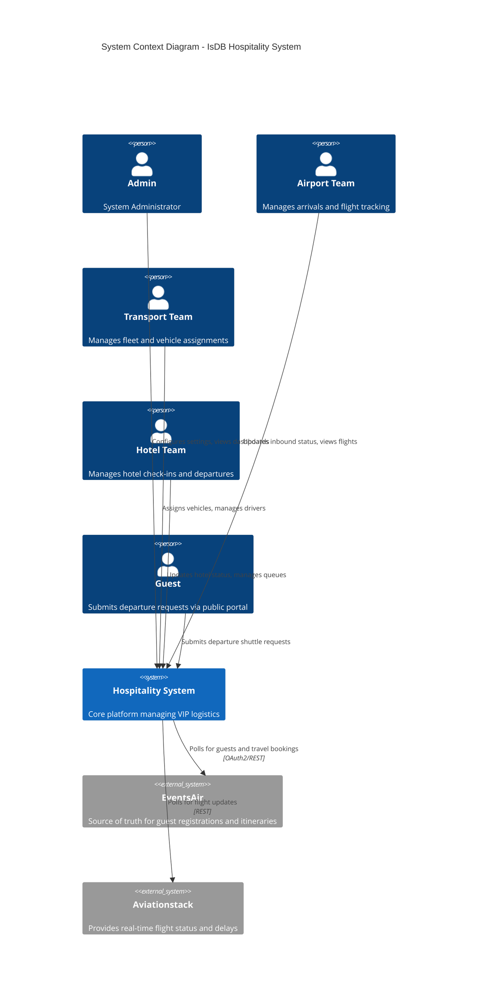
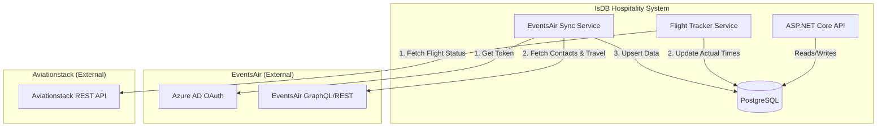
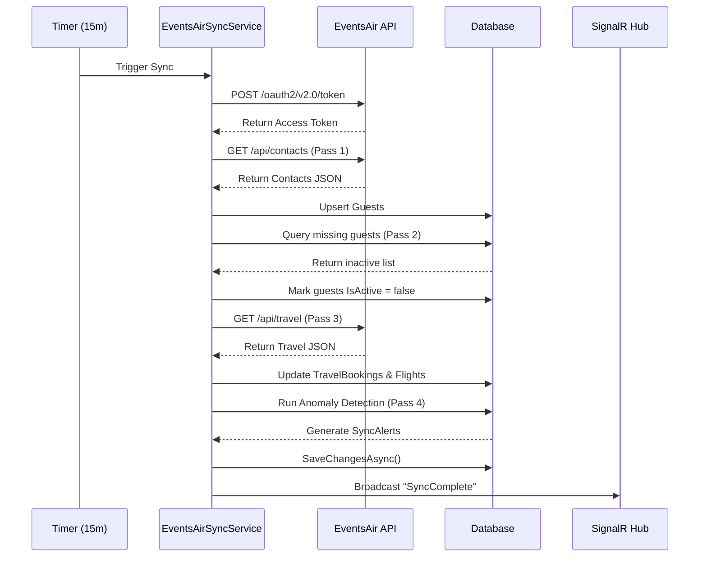
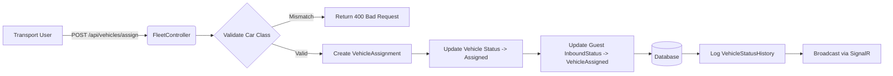

## 9. AI Review Package

### 9.1 Overall Architecture Quality
The IsDB Annual Meetings Hospitality System exhibits a mature, well-structured architecture. The adoption of Clean Architecture principles and CQRS (via MediatR) ensures a high degree of maintainability and separation of concerns. The use of React with TypeScript and Tailwind on the frontend provides a modern, responsive user experience. The integration of SignalR for real-time updates and background services for external API synchronization demonstrates a solid understanding of event-driven and asynchronous processing patterns.

### 9.2 Potential Improvements
- **Event-Driven Decoupling:** The `EventsAirSyncService` tightly couples data ingestion with business logic (e.g., alert generation). Introducing an event bus (like RabbitMQ or Azure Service Bus) would allow the sync service to merely publish "GuestUpdated" events, which separate consumers could handle for alerting, flight matching, etc.
- **Delta Synchronization:** Transitioning the EventsAir sync from a full-pull model to a delta-pull model (using `LastModified` timestamps) is critical for long-term scalability.
- **Distributed Caching:** Replacing `IMemoryCache` with Redis will prepare the application for horizontal scaling.

### 9.3 Areas Where a Senior Architect Should Focus
1. **The Sync Engine:** Review `EventsAirSyncService.cs`. The multi-pass logic is complex and handles state mutation directly. Assess the feasibility of breaking this into a pipeline or saga pattern.
2. **Flight Matching Logic:** Review how Aviationstack data is merged with EventsAir travel bookings. The `FlightTrackerSyncService.cs` and `FlightNumberHelper.cs` are critical points where data inconsistencies often arise.
3. **Database Concurrency:** Review the handling of `CurrentGuestId` on the `Vehicle` entity. Ensure that concurrent assignments do not lead to race conditions.

### 9.4 Questions for Architecture Review
- How does the system handle an EventsAir API outage during a critical operational window? Is there a fallback mechanism?
- What is the data retention policy for PII (Personally Identifiable Information) stored in the `Guests` table post-event?
- How are breaking changes in the EventsAir custom field schema handled without requiring a code deployment?

### 9.5 Files and Modules Deserving Special Attention
- `src/IsDB.Hospitality.Infrastructure/BackgroundServices/EventsAirSyncService.cs`
- `src/IsDB.Hospitality.Infrastructure/ExternalClients/FlightTracker/AviationstackClient.cs`
- `src/IsDB.Hospitality.Domain/Entities/Guest.cs` (specifically the journey status properties)
- `src/IsDB.Hospitality.API/Filters/ActiveUserFilter.cs`

---

## 10. Diagrams (Mermaid)

### 10.1 System Context Diagram

### 10.2 Integration Landscape Diagram

### 10.3 Sequence Diagram: EventsAir Sync Flow

### 10.4 Data Flow Diagram: Vehicle Assignment

---

## 11. Integration Architecture & Interface Documentation

### 11.1 Integration: EventsAir

- **System Name:** EventsAir
- **Purpose:** Primary source of truth for guest registrations, demographic data, custom fields (Rank, Dedicated Car), marketing tags, and travel itineraries.
- **Business Owner:** Registration/Protocol Team
- **Technical Owner:** Backend Engineering Team
- **Environment Details:** Production endpoint configured via `AppConfig`.
- **Authentication Method:** OAuth2 Client Credentials flow via Microsoft Azure AD (`login.microsoftonline.com`).
- **Endpoint Inventory:**
  - `POST /oauth2/v2.0/token`: Acquires Bearer token.
  - `GET /api/v1/events/{EventCode}/contacts`: Fetches guest profiles.
  - `GET /api/v1/events/{EventCode}/travel`: Fetches travel bookings.
- **Data Mappings:**
  - `ContactId` -> `Guest.EventsAirContactId`
  - Custom Field `d6b74b23...` -> `Guest.DedicatedCar`
  - Marketing Tag "Hotel" -> `Guest.OldHotel`
- **Data Transformation Rules:**
  - Flight numbers are normalized (spaces/hyphens removed, converted to uppercase) before linking to the `Flight` entity.
  - Contacts without the "Dedicated Car" custom field are filtered out or deactivated during Pass 2.
- **Error Handling:**
  - `GlobalExceptionMiddleware` catches parsing errors.
  - API failures result in a `SyncStatus.Failed` log entry in `EventsAirSyncLogs`.
- **Retry Logic:** Polly `WaitAndRetryAsync` (3 retries, exponential backoff starting at 2 seconds).
- **Timeout Configuration:** Default `HttpClient` timeout (100 seconds).
- **Security Controls:** Credentials stored in DB, token cached in memory for `expires_in - 60` seconds.
- **Monitoring and Alerting:** Failures logged to `SystemLogs` (Severity: Error). Sync summary available on Admin Dashboard.
- **Known Limitations:** Full data pull on every sync; no delta/webhook support currently implemented.

### 11.2 Integration: Aviationstack

- **System Name:** Aviationstack
- **Purpose:** Provides real-time flight tracking data (actual arrival/departure times, delays, terminal/gate info) to augment scheduled times from EventsAir.
- **Business Owner:** Airport Operations Team
- **Technical Owner:** Backend Engineering Team
- **Environment Details:** Production endpoint `http://api.aviationstack.com/v1`.
- **Authentication Method:** Query parameter `access_key`.
- **Endpoint Inventory:**
  - `GET /flights`: Fetches real-time status for a specific `flight_iata`.
- **Data Mappings:**
  - `arrival.actual` -> `Flight.ActualArrival`
  - `arrival.delay` -> `Flight.LiveDelayMinutes`
  - `flight_status` -> `Flight.Status` (Mapped to internal `FlightStatus` enum).
- **Data Transformation Rules:**
  - Internal flight numbers are normalized to match Aviationstack's IATA format requirements.
  - Results with a date difference greater than `DateGuardDays` (default 1) compared to the scheduled date are discarded to prevent cross-day contamination.
- **Error Handling:**
  - 401/403 responses throw an `InvalidOperationException`, marking the sync as failed and alerting admins to check the API key.
- **Retry Logic:** Polly `WaitAndRetryAsync` (3 retries, exponential backoff) for 5xx and network errors.
- **Timeout Configuration:** Default `HttpClient` timeout.
- **Security Controls:** API key stored in `AppConfig` (DB).
- **Monitoring and Alerting:** Unconfigured API key triggers a degraded state in `/api/health` and logs a warning to `SystemLogs`.
- **Known Limitations:** The API is polled. High volume of unique flights may consume API quota rapidly. The `TrackingWindowHours` setting mitigates this by only polling flights arriving soon.
