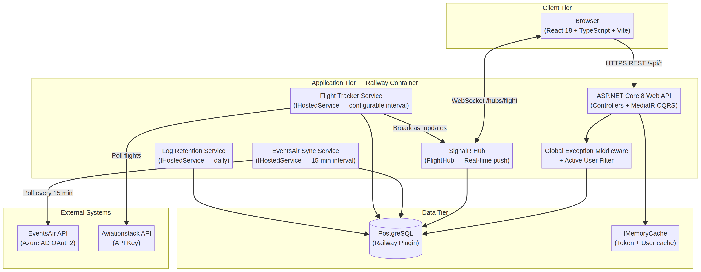
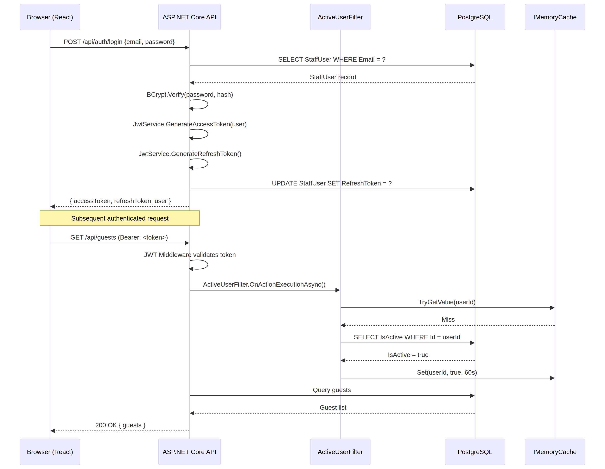
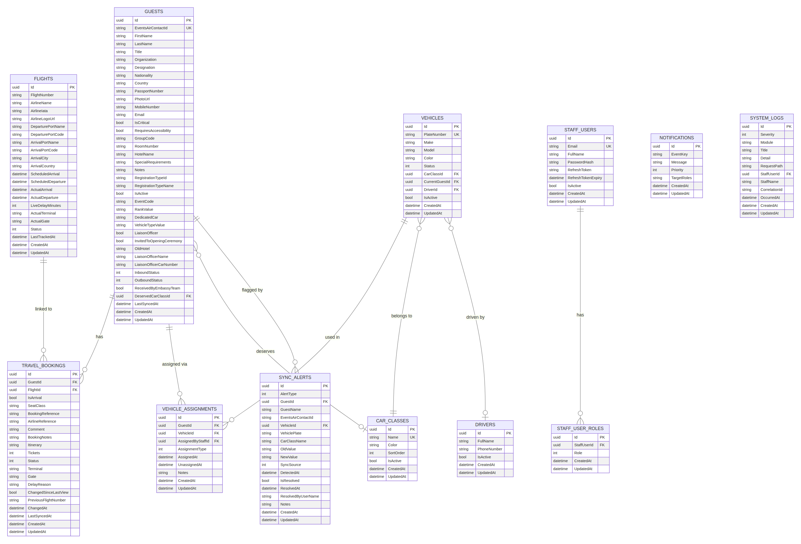
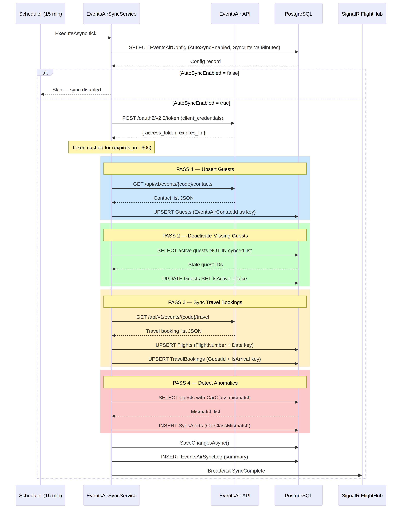
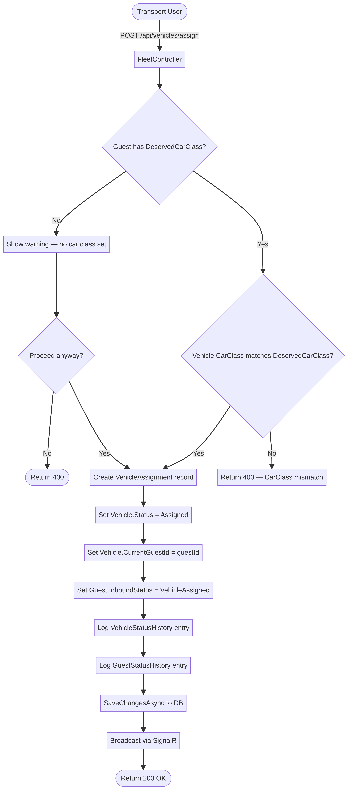
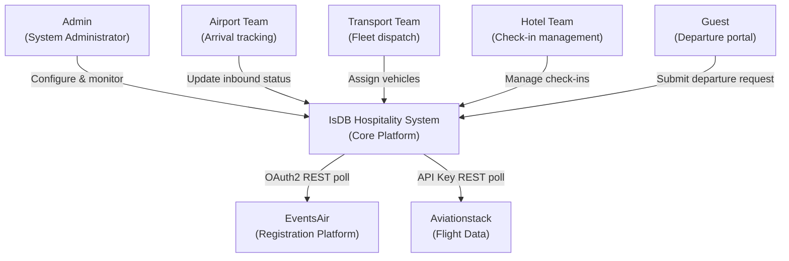
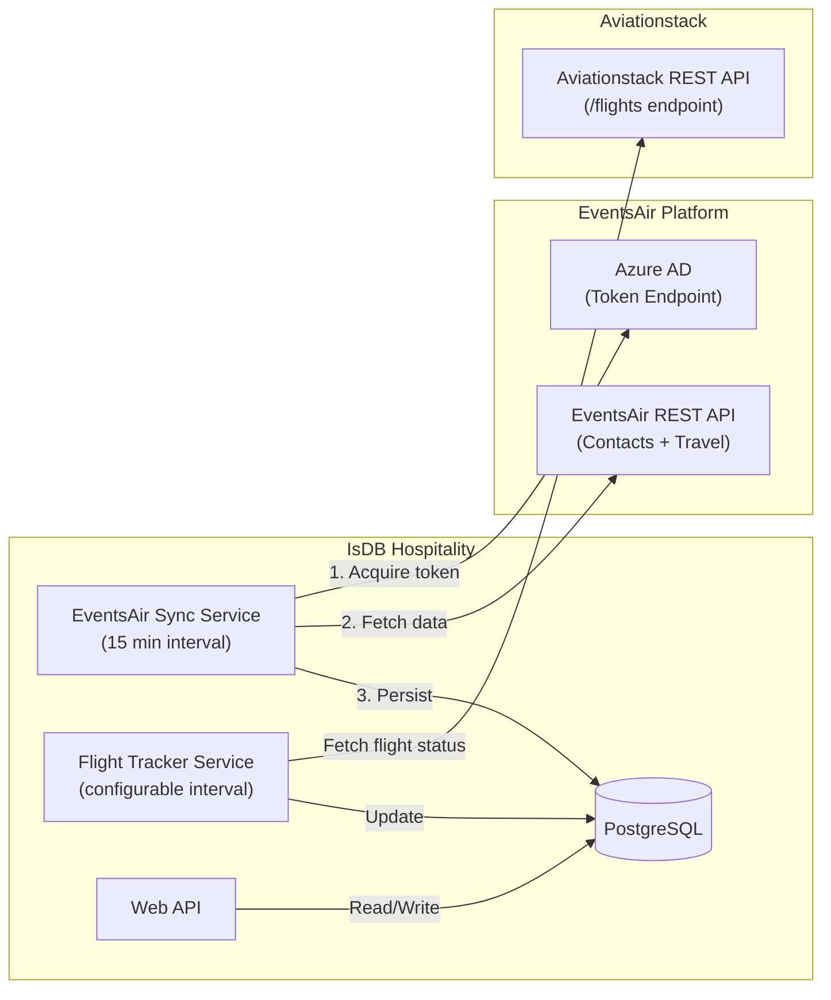

# IsDB Annual Meetings Hospitality System
# Technical Handover Package — v4.1.0

**Prepared by:** Manus AI  
**Date:** June 2026  
**Repository:** [muradIsdb/AnnualMeetings](https://github.com/muradIsdb/AnnualMeetings)  
**Production Release:** v4.1.0  
**UAT Release:** v4.2.0-uat-stable

---

## Table of Contents

1. [Executive Summary](#1-executive-summary)
2. [System Architecture Document](#2-system-architecture-document)
3. [Technical Design Document](#3-technical-design-document)
4. [Codebase Documentation](#4-codebase-documentation)
5. [Database Documentation](#5-database-documentation)
6. [API Documentation](#6-api-documentation)
7. [Security Assessment](#7-security-assessment)
8. [Technical Debt Assessment](#8-technical-debt-assessment)
9. [AI Review Package](#9-ai-review-package)
10. [Diagrams](#10-diagrams)
11. [Integration Architecture & Interface Documentation](#11-integration-architecture--interface-documentation)

---

## 1. Executive Summary

### 1.1 Purpose of the System

The IsDB Annual Meetings Hospitality System is a comprehensive, real-time logistics and guest management platform designed to orchestrate the end-to-end journey of VIPs, delegates, and officials attending the Islamic Development Bank's Annual Meetings. It bridges the gap between registration data (sourced from EventsAir) and on-the-ground operational execution across airport reception, fleet management, and hotel coordination teams.

### 1.2 Main Business Processes

The system manages six core business processes. **Guest Synchronization** provides automated, continuous ingestion of guest profiles, registration types, marketing tags, and travel itineraries from the EventsAir platform. **Inbound Journey Tracking** orchestrates the guest experience from airport arrival through embassy reception, vehicle assignment, and hotel check-in. **Fleet and Transport Management** governs a pool of vehicles, drivers, and car classes with rule-based auto-assignment and real-time dispatching. **Flight Tracking** integrates with the Aviationstack API to monitor real-time flight statuses and delays. **Outbound Journey Management** handles departure requests via a public-facing portal, allowing guests to book shuttles managed by the transport team. Finally, **Cross-Team Communication** provides a role-based notification system broadcasting critical events across all operational teams.

### 1.3 Key Features

| Feature | Description |
|---|---|
| Real-Time Dashboards | Role-specific dashboards for Airport, Transport, Hotel, Control Room, and Liaison |
| Automated Sync & Alerting | Background services polling EventsAir and Aviationstack with anomaly detection |
| Dynamic RBAC | JWT-based authentication with granular role-based access control |
| Placard Generation | Automated welcome placards with configurable event logos |
| Audit Trail | Comprehensive logging of status changes, assignments, and system events |
| Departure Portal | Public-facing self-service shuttle booking with token-based management |

---

## 2. System Architecture Document

### 2.1 High-Level Architecture Diagram



The system follows a three-tier architecture: a **Client Tier** (React SPA), an **Application Tier** (ASP.NET Core 8 API running on Railway), and a **Data Tier** (PostgreSQL). Two external systems — EventsAir and Aviationstack — are consumed exclusively by background services in the Application Tier, ensuring the API remains responsive to user requests regardless of external API latency.

### 2.2 Detailed Component Architecture

The system is built using a **Clean Architecture** approach, enforcing a strict inward dependency rule across four layers:

| Layer | Project | Responsibility |
|---|---|---|
| Domain | `IsDB.Hospitality.Domain` | Entities, enums, base classes, domain exceptions |
| Application | `IsDB.Hospitality.Application` | CQRS handlers (MediatR), DTOs, interfaces, validators |
| Infrastructure | `IsDB.Hospitality.Infrastructure` | EF Core, external API clients, background services, JWT |
| Presentation | `IsDB.Hospitality.API` | Controllers, SignalR hubs, middleware, health checks |

### 2.3 Frontend Architecture

The frontend is a React 18 SPA built with TypeScript and Vite. State is managed at two levels: **Zustand** handles global client state (authentication, UI preferences) persisted to `localStorage`, while **TanStack React Query** manages all server state with automatic caching, background refetching, and optimistic updates. Routing is handled by React Router DOM v6 with a `ProtectedRoute` wrapper that enforces role-based access at the component level. Styling uses Tailwind CSS with Lucide React for iconography.

### 2.4 Backend Architecture

The backend uses the **CQRS pattern** via MediatR, separating read operations (Queries) from write operations (Commands). Real-time capabilities are provided by **SignalR**, which pushes flight status updates and operational notifications to connected clients. Three `IHostedService` implementations run concurrently: `EventsAirSyncService` (guest and travel sync), `FlightTrackerSyncService` (Aviationstack polling), and `LogRetentionService` (automated log cleanup).

### 2.5 Database Architecture

Entity Framework Core 8 manages the schema via code-first migrations. The production database is PostgreSQL (Railway plugin), while SQLite is used for local development. The schema is highly normalized with explicit foreign key constraints, cascade delete rules, and strategic composite indexes on high-frequency query paths.

### 2.6 Authentication and Authorization Flow



The authentication flow is as follows: the user submits credentials to `/api/auth/login`, the system verifies the BCrypt password hash, and `JwtService` generates an access token (containing `ClaimTypes.Role`) and a cryptographically random refresh token. The frontend Axios interceptor attaches the Bearer token to all outbound requests. Controllers enforce `[Authorize(Roles = "...")]` attributes. A global `ActiveUserFilter` verifies the user hasn't been deactivated mid-session, using a 60-second in-memory cache to minimize database round-trips.

### 2.7 External Integrations

| System | Purpose | Auth Method | Direction |
|---|---|---|---|
| EventsAir | Guest registrations, travel itineraries, custom fields | OAuth2 Client Credentials (Azure AD) | Inbound (pull) |
| Aviationstack | Real-time flight tracking, delays, terminal info | API Key (query param) | Inbound (pull) |

### 2.8 Deployment Architecture

The application is containerized via a **multi-stage Dockerfile**. Stage 1 restores NuGet packages and builds the .NET solution. Stage 2 builds the React frontend with Vite. Stage 3 produces a minimal runtime image with the published API and the compiled frontend assets in `wwwroot`. Railway detects the Dockerfile, builds the container, and injects environment variables. Database migrations are applied automatically at startup.

---

## 3. Technical Design Document

### 3.1 Technology Stack and Versions

| Component | Technology | Version |
|---|---|---|
| Backend Framework | ASP.NET Core | 8.0 |
| Language | C# | 12 |
| Frontend Framework | React | 18.2.0 |
| Frontend Language | TypeScript | 5.2.2 |
| Build Tool | Vite | 5.0.11 |
| ORM | Entity Framework Core | 8.0.0 |
| Database (Production) | PostgreSQL | Railway managed |
| Database (Dev) | SQLite | Latest |
| CQRS | MediatR | 12.4.1 |
| Object Mapping | AutoMapper | 13.0.1 |
| Validation | FluentValidation | 11.11.0 |
| Resilience | Polly | 8.5.2 |
| Password Hashing | BCrypt.Net-Next | 4.0.3 |
| Logging | Serilog | 8.0.3 |
| State Management | Zustand | 4.4.7 |
| Server State | TanStack React Query | 5.17.19 |
| Styling | Tailwind CSS | 3.4.1 |
| HTTP Client | Axios | 1.6.5 |

### 3.2 Design Patterns Used

The codebase employs several well-established patterns. **Clean Architecture** enforces a strict inward dependency rule, ensuring the Domain layer has no dependencies on infrastructure concerns. **CQRS** via MediatR separates reads from writes, improving testability and enabling independent scaling of query and command paths. The **Options Pattern** provides strongly typed configuration binding for external service credentials. The **Middleware Pattern** is used for cross-cutting concerns including global exception handling and active user validation.

### 3.3 Major Modules and Responsibilities

| Module | Key Files | Responsibility |
|---|---|---|
| Guest Management | `GuestsController.cs`, `Guest.cs` | Profiles, journey status, registration types |
| Fleet Management | `FleetController.cs`, `VehiclesController.cs` | Vehicles, drivers, car classes, assignments |
| Flight Management | `FlightTrackerSyncService.cs`, `Flight.cs` | Schedules, real-time tracking, delay alerts |
| Sync & Alerts | `EventsAirSyncService.cs`, `SyncAlert.cs` | Data ingestion, anomaly detection |
| Notifications | `NotificationTemplateService.cs` | Role-based messaging with read receipts |
| Auth | `AuthController.cs`, `JwtService.cs` | Login, token management, RBAC |
| Departure Portal | `DepartureRequestsController.cs` | Public shuttle booking, token-based access |

### 3.4 Error Handling Strategy

The backend employs a layered error handling strategy. The `GlobalExceptionMiddleware` catches all unhandled exceptions, logs them to the `SystemLogs` table via `ISystemLogService`, and returns a standardized JSON error response. FluentValidation handles input validation errors, returning structured 400 Bad Request responses with field-level detail. Polly retry policies on external API clients handle transient network failures. On the frontend, Axios interceptors handle 401 Unauthorized responses by clearing local storage and redirecting to the login page.

### 3.5 Logging and Monitoring Approach

Serilog provides structured logging to the console, captured by Railway's log aggregator. Critical system events, sync results, and unhandled exceptions are simultaneously written to the `SystemLogs` database table, making them accessible to administrators within the application UI without requiring access to Railway. A background `LogRetentionService` automatically purges logs older than 30 days to manage database size.

---

## 4. Codebase Documentation

### 4.1 Complete Project Structure

```text
AnnualMeetingsRepo/
├── src/
│   ├── IsDB.Hospitality.API/              # Presentation Layer
│   │   ├── Controllers/                   # 20+ API controllers
│   │   ├── Filters/                       # ActiveUserFilter
│   │   ├── HealthChecks/                  # AviationstackHealthCheck
│   │   ├── Hubs/                          # FlightHub (SignalR)
│   │   ├── Middlewares/                   # GlobalExceptionMiddleware
│   │   ├── Services/                      # NotificationTemplateService
│   │   ├── Program.cs                     # DI wiring, middleware pipeline
│   │   ├── appsettings.json               # Base configuration
│   │   └── appsettings.Production.json    # Production overrides
│   ├── IsDB.Hospitality.Application/      # Business Logic Layer
│   │   ├── Common/
│   │   │   ├── Interfaces/                # IEventsAirClient, IJwtService, etc.
│   │   │   └── Models/                    # EventsAirContactDto, EventsAirTravelDto
│   │   └── Features/                      # MediatR Commands and Queries
│   ├── IsDB.Hospitality.Domain/           # Domain Layer
│   │   ├── Common/                        # BaseEntity
│   │   ├── Entities/                      # All domain entities
│   │   ├── Enums/                         # All domain enumerations
│   │   └── Exceptions/                    # Domain-specific exceptions
│   └── IsDB.Hospitality.Infrastructure/   # Infrastructure Layer
│       ├── BackgroundServices/            # EventsAirSyncService, FlightTrackerSyncService
│       ├── ExternalClients/               # EventsAirClient, AviationstackClient
│       ├── Persistence/                   # AppDbContext, Configurations, Migrations
│       └── Services/                      # JwtService, SystemLogService
├── frontend/                              # React SPA Source
│   ├── src/
│   │   ├── api/                           # client.ts (Axios), services.ts
│   │   ├── components/                    # Reusable UI components
│   │   ├── pages/                         # Route-level page components (by module)
│   │   ├── store/                         # authStore.ts (Zustand)
│   │   └── types/                         # index.ts (TypeScript types and enums)
│   ├── package.json
│   └── vite.config.ts
├── Dockerfile                             # Multi-stage build
├── railway.json                           # Railway deployment config
└── IsDB.Hospitality.sln                   # .NET Solution file
```

### 4.2 Explanation of Major Folders and Modules

The **Domain Layer** (`IsDB.Hospitality.Domain`) is the innermost layer and has no external dependencies. It defines the `BaseEntity` (with `Id`, `CreatedAt`, `UpdatedAt`), all domain entities, and all enumerations. The **Application Layer** defines interfaces that the Infrastructure layer must implement, ensuring the Domain and Application layers remain testable in isolation. The **Infrastructure Layer** contains all "dirty" concerns: database access via EF Core, HTTP calls to external APIs, and background processing. The **API Layer** is responsible solely for receiving HTTP requests, delegating to MediatR handlers, and returning responses.

### 4.3 Dependency Inventory

**Backend Key Dependencies:**

| Package | Version | Purpose |
|---|---|---|
| `Microsoft.EntityFrameworkCore` | 8.0.0 | ORM and database access |
| `Npgsql.EntityFrameworkCore.PostgreSQL` | 8.0.0 | PostgreSQL provider |
| `MediatR` | 12.4.1 | CQRS implementation |
| `AutoMapper` | 13.0.1 | Object-to-object mapping |
| `FluentValidation` | 11.11.0 | Input validation |
| `Polly` | 8.5.2 | Resilience and retry policies |
| `BCrypt.Net-Next` | 4.0.3 | Password hashing |
| `Serilog` | 8.0.3 | Structured logging |
| `Microsoft.AspNetCore.SignalR` | 8.0.0 | Real-time WebSocket communication |

**Frontend Key Dependencies:**

| Package | Version | Purpose |
|---|---|---|
| `react` | 18.2.0 | UI framework |
| `react-router-dom` | 6.21.3 | Client-side routing |
| `@tanstack/react-query` | 5.17.19 | Server state management |
| `zustand` | 4.4.7 | Global client state |
| `axios` | 1.6.5 | HTTP client with interceptors |
| `tailwindcss` | 3.4.1 | Utility-first CSS framework |
| `recharts` | 3.8.1 | Data visualization charts |
| `lucide-react` | 0.309.0 | Icon library |

### 4.4 Environment Variables and Configuration Documentation

| Variable | Required | Description |
|---|---|---|
| `DATABASE_URL` | Yes | PostgreSQL connection string (injected by Railway) |
| `Jwt__Key` | Yes | Secret key for signing JWT tokens (min 32 chars) |
| `Jwt__Issuer` | Yes | JWT issuer claim |
| `Jwt__Audience` | Yes | JWT audience claim |
| `EventsAir__ClientId` | No | EventsAir OAuth2 client ID (can be set in DB) |
| `EventsAir__ClientSecret` | No | EventsAir OAuth2 client secret (can be set in DB) |
| `Aviationstack__ApiKey` | No | Aviationstack API key (can be set in DB via Platform Settings) |
| `PORT` | Yes | HTTP listening port (injected by Railway) |
| `AllowedOrigins` | No | Comma-separated CORS allowed origins |

### 4.5 Build and Deployment Process

The deployment pipeline is fully automated via Railway's GitHub integration. On every push to the `master` branch, Railway detects the `Dockerfile`, builds the multi-stage container, and deploys it. The build process compiles the React frontend (via `pnpm build`), publishes the .NET API, and copies the frontend build output to the API's `wwwroot` folder. At startup, `Program.cs` applies any pending EF Core migrations and runs the idempotent `production_seed.sql` script to ensure default configuration records exist.

---

## 5. Database Documentation

### 5.1 Entity Relationship Diagram (ERD)



### 5.2 Table Descriptions

| Table | Description |
|---|---|
| `Guests` | Core VIP contact records with journey status, hotel info, and EventsAir metadata |
| `Flights` | Shared flight records with scheduled and real-time tracking data |
| `TravelBookings` | Links guests to flights with booking-specific details; includes change history |
| `Vehicles` | Fleet vehicles with current status and car class assignment |
| `Drivers` | Driver profiles linked to vehicles |
| `CarClasses` | Vehicle classification tiers (e.g., VIP, Standard) with color coding |
| `VehicleAssignments` | Historical record of all guest-to-vehicle assignments |
| `StaffUsers` | Authentication records for all operational staff |
| `StaffUserRoles` | Many-to-many join table enabling multi-role users |
| `SyncAlerts` | Anomalies detected during EventsAir sync requiring manual review |
| `Notifications` | Internal broadcast messages with role targeting |
| `NotificationReads` | Read receipts per user per notification |
| `SystemLogs` | Persistent application event and error log |
| `AppConfig` | Singleton platform configuration (Aviationstack key, placard settings) |
| `EventsAirConfig` | EventsAir connection settings and sync parameters |
| `DepartureRequests` | Public shuttle booking requests with token-based access |

### 5.3 Relationships

The `Guest` entity is the central hub of the schema. It has one-to-many relationships with `TravelBookings`, `VehicleAssignments`, `GuestStatusHistory`, `ChecklistCompletions`, and `SyncAlerts`. The `TravelBooking` entity bridges `Guest` and `Flight`, allowing multiple guests to share a flight record while maintaining individual booking details. The `Vehicle` entity maintains a direct foreign key to `CarClass` and an optional foreign key to `Driver`. Deleting a guest cascades to their bookings and assignments, but sets `GuestId` to null on `SyncAlerts` to preserve the audit trail.

### 5.4 Indexes and Performance Considerations

| Table | Index | Type | Purpose |
|---|---|---|---|
| `Guests` | `EventsAirContactId` | Unique | Fast upsert during sync |
| `Guests` | `IsActive`, `Status`, `InboundStatus` | Non-unique | Dashboard filtering |
| `Guests` | `(IsCritical, LastName)` | Composite | VIP list sorting |
| `Flights` | `Status`, `ScheduledArrival` | Non-unique | Flight tracker queries |
| `TravelBookings` | `GuestId`, `FlightId`, `IsArrival` | Non-unique | Booking lookups |
| `SyncAlerts` | `(IsResolved, DetectedAt)` | Composite | Alert dashboard |
| `SystemLogs` | `(Severity, OccurredAt)` | Composite | Log viewer filtering |

---

## 6. API Documentation

### 6.1 All Endpoints (Summary)

| Controller | Base Route | Key Endpoints |
|---|---|---|
| Auth | `/api/auth` | `POST /login`, `POST /change-password`, `POST /refresh` |
| Guests | `/api/guests` | `GET /`, `GET /{id}`, `POST /{id}/inbound-status`, `POST /sync-from-eventsair` |
| Fleet/Vehicles | `/api/vehicles` | `GET /`, `POST /assign`, `DELETE /{id}/unassign` |
| Car Classes | `/api/car-classes` | `GET /`, `POST /`, `PUT /{id}`, `DELETE /{id}` |
| Dashboard | `/api/dashboard` | `GET /summary`, `GET /hotel-summary`, `GET /control-room` |
| Sync Alerts | `/api/transport-actions` | `GET /`, `POST /{id}/resolve` |
| Notifications | `/api/notifications` | `GET /`, `POST /{id}/read` |
| Settings | `/api/settings` | `GET /config`, `PUT /config`, `GET /eventsair-config` |
| EventsAir | `/api/eventsair` | `POST /sync`, `GET /sync-status`, `POST /deactivate-canceled-guests` |
| Departure Requests | `/api/departure-requests` | `POST /` (public), `GET /manage/{token}` (public), `GET /` (Admin) |
| System Logs | `/api/system-logs` | `GET /` (Admin only) |
| Health | `/api/health` | `GET /` (public) |

### 6.2 Authentication Methods

All endpoints except `/api/auth/login`, `/api/health`, and the public Departure Request endpoints require a JWT Bearer token in the `Authorization` header. Access tokens have an 8-hour lifespan. Refresh tokens are valid for 7 days and are used to obtain new access tokens without re-authentication.

### 6.3 Request and Response Examples

**Update Inbound Status:**
`POST /api/guests/{id}/inbound-status`
```json
// Request
{ "status": 3, "notes": "Driver dispatched, ETA 10 min" }

// Response 200 OK
{ "id": "...", "inboundStatus": 3, "inboundStatusLabel": "Vehicle Assigned" }
```

**Assign Vehicle:**
`POST /api/vehicles/assign`
```json
// Request
{ "guestId": "...", "vehicleId": "...", "assignmentType": 0 }

// Response 200 OK
{ "vehicleId": "...", "guestId": "...", "assignedAt": "2026-06-08T..." }
```

### 6.4 Error Handling Conventions

All API errors return a consistent JSON structure:
```json
{
  "message": "Human-readable error description",
  "error": "Technical detail (development/UAT environments only)"
}
```
Validation errors return HTTP 400 with a `errors` dictionary mapping field names to arrays of validation messages. Unauthorized requests return HTTP 401. Forbidden role access returns HTTP 403.

---

## 7. Security Assessment

### 7.1 Authentication Review

**Strengths:** The system uses industry-standard JWT with BCrypt password hashing (cost factor 12). Refresh tokens are generated using `RandomNumberGenerator.GetBytes(64)`, ensuring cryptographic randomness. The `ActiveUserFilter` effectively mitigates the stale JWT problem by checking the database (via a 60-second in-memory cache) on every request.

**Observations:** Refresh tokens are stored in plain text in the database. While the risk is mitigated by database access controls, hashing them with BCrypt would provide defense-in-depth against database credential leaks.

### 7.2 Authorization Review

**Strengths:** Granular `[Authorize(Roles = "...")]` attributes are applied consistently across all sensitive endpoints. The frontend `ProtectedRoute` wrapper provides a secondary layer of access control at the UI level.

**Observations:** A small number of EventsAir controller endpoints use `[Authorize]` without a role restriction (lines 938, 1000, 1060), allowing any authenticated user to access them. These should be reviewed to confirm whether role restriction is intentional.

### 7.3 Input Validation Review

**Strengths:** FluentValidation is applied to all command and query DTOs. The `SlugifyParameterTransformer` ensures consistent URL routing. The `AviationstackHealthCheck` gracefully handles missing API keys without crashing the application.

**Observations:** The Departure Request form uses a honeypot field as a basic bot mitigation measure, which is appropriate for a low-risk public form.

### 7.4 Secrets Management Review

**Strengths:** External API credentials (EventsAir, Aviationstack) are stored in the database, allowing dynamic updates without redeployment. Railway environment variables inject the JWT signing key and database connection string at runtime, keeping them out of source code.

**Risk:** Database-stored credentials (EventsAir `ClientSecret`, Aviationstack `ApiKey`) are stored in plain text. A compromised database means compromised external API access. Encrypting these columns using a master key injected via environment variable would significantly reduce this risk.

### 7.5 OWASP-Related Observations

| Risk | Status | Mitigation |
|---|---|---|
| SQL Injection | Mitigated | EF Core uses parameterized queries exclusively |
| XSS | Mitigated | React auto-escapes all rendered output |
| CSRF | Mitigated | JWT Bearer tokens are not automatically sent by browsers |
| Broken Access Control | Partially mitigated | Role checks on most endpoints; a few need review |
| Security Misconfiguration | Low risk | CORS configured with allowlist; health endpoint is public but non-sensitive |
| Sensitive Data Exposure | Moderate risk | PII in DB; API credentials stored in plain text |

---

## 8. Technical Debt Assessment

### 8.1 Code Smells

The most significant code smell is the size and complexity of `EventsAirSyncService.cs` (619 lines). This single class is responsible for token acquisition, contact fetching, guest upsert, deactivation, travel booking sync, and anomaly detection — violating the Single Responsibility Principle. Each sync pass should be extracted into a dedicated strategy class.

The `Guest` entity has grown to over 50 properties, many of which are tightly coupled to specific EventsAir custom field GUIDs hardcoded in the sync service. This creates a brittle coupling between the data model and a specific EventsAir event configuration.

### 8.2 Areas Requiring Refactoring

The EventsAir sync logic relies on hardcoded GUIDs for custom fields (e.g., `d6b74b23-c8b6-d044-5d86-3a17bafe27de` for the "Dedicated Car" field). While a `SyncFieldMappings` table exists in the database, it is not yet fully utilized to drive the sync logic dynamically. Completing this migration would make the system event-agnostic and significantly reduce the cost of onboarding a new annual meeting.

### 8.3 Duplicate Logic

Authorization role definitions exist in two places: the backend `[Authorize(Roles = "...")]` attributes and the frontend `ProtectedRoute` `allowedRoles` arrays. These can drift independently. Generating TypeScript types from the backend C# enums (e.g., using NSwag or a custom T4 template) would enforce alignment.

### 8.4 Performance Bottlenecks

The EventsAir sync performs a full data pull on every execution cycle. As the event grows, this will hit API rate limits and increase memory pressure. Implementing delta synchronization using `LastModified` timestamps from EventsAir is the highest-priority performance improvement.

SignalR currently broadcasts all flight updates to all connected clients in the "airport" group. As user concurrency increases, scoping broadcasts to specific flight numbers or role-based groups would reduce unnecessary network traffic.

### 8.5 Scalability Limitations

The `IMemoryCache` used by `ActiveUserFilter` and `EventsAirClient` is process-local. If the application is scaled horizontally across multiple Railway instances, cache invalidation will not propagate between instances. Migrating to a distributed cache (Redis) is required before horizontal scaling can be safely adopted.

### 8.6 Maintainability Concerns

The `production_seed.sql` script is manually maintained and executed on startup. While idempotent, it makes tracking configuration changes difficult and is error-prone. Migrating this to EF Core's `HasData()` seeding or a dedicated migration step would improve traceability and reduce the risk of configuration drift between environments.

---

## 9. AI Review Package

### 9.1 Overall Architecture Quality

The IsDB Annual Meetings Hospitality System exhibits a mature, well-structured architecture. The adoption of Clean Architecture principles and CQRS via MediatR ensures a high degree of maintainability and separation of concerns. The use of React with TypeScript and Tailwind on the frontend provides a modern, responsive user experience. The integration of SignalR for real-time updates and background services for external API synchronization demonstrates a solid understanding of event-driven and asynchronous processing patterns. The codebase is well-commented, particularly around domain-specific business rules.

### 9.2 Potential Improvements

The three most impactful improvements, in priority order, are as follows. First, **delta synchronization** for EventsAir would eliminate the full-pull bottleneck and allow the system to scale to larger events without hitting API limits. Second, **distributed caching** (Redis) would enable horizontal scaling on Railway without cache coherence issues. Third, **event-driven decoupling** of the sync engine — introducing an internal event bus so that the sync service publishes events and separate consumers handle alerting, notification dispatch, and flight matching — would dramatically improve testability and maintainability.

### 9.3 Areas Where a Senior Architect Should Focus

A senior architect reviewing this system should prioritize three areas. The **Sync Engine** (`EventsAirSyncService.cs`) is the most complex and highest-risk component; its multi-pass logic handles direct state mutation and should be assessed for a pipeline or saga pattern refactor. The **Flight Matching Logic** (`FlightTrackerSyncService.cs` and `FlightNumberHelper.cs`) is a critical data quality boundary where inconsistencies between Aviationstack's IATA format and EventsAir's free-text flight numbers can cause silent data mismatches. The **Database Concurrency Model** around `Vehicle.CurrentGuestId` should be reviewed to ensure concurrent assignment requests cannot produce race conditions.

### 9.4 Questions for Architecture Review

The following questions should be addressed during a formal architecture review session:

1. How does the system behave during an EventsAir API outage during a critical operational window (e.g., peak arrival day)? Is there a manual override or fallback mechanism?
2. What is the data retention and deletion policy for PII stored in the `Guests` table after the event concludes?
3. How are breaking changes in the EventsAir custom field schema (e.g., a new GUID for the "Dedicated Car" field) handled without requiring a code deployment?
4. Is the current single-instance Railway deployment sufficient, or is there a business continuity requirement for high availability?
5. What is the disaster recovery plan if the Railway PostgreSQL instance becomes unavailable?

### 9.5 Files and Modules Deserving Special Attention

| File | Reason |
|---|---|
| `EventsAirSyncService.cs` | Most complex business logic; highest refactoring priority |
| `FlightTrackerSyncService.cs` | Critical data quality boundary between two external systems |
| `Guest.cs` | Central domain entity; growing complexity warrants review |
| `ActiveUserFilter.cs` | Security-critical component; cache invalidation logic is subtle |
| `GuestConfiguration.cs` | Defines all DB indexes and cascade rules; performance-critical |
| `App.tsx` (frontend) | Defines all role-based routing; must stay in sync with backend |

---

## 10. Diagrams

### 10.1 High-Level Architecture


### 10.2 Authentication Flow


### 10.3 EventsAir Sync Sequence



### 10.4 Vehicle Assignment Data Flow



### 10.5 Entity Relationship Diagram


---

## 11. Integration Architecture & Interface Documentation

### 11.1 System Context Diagram



### 11.2 Integration Landscape Diagram



### 11.3 Integration: EventsAir

| Attribute | Value |
|---|---|
| **System Name** | EventsAir |
| **Purpose** | Primary source of truth for guest registrations, custom fields, marketing tags, and travel itineraries |
| **Business Owner** | Registration / Protocol Team |
| **Technical Owner** | Backend Engineering Team |
| **Authentication** | OAuth2 Client Credentials via Microsoft Azure AD |
| **Token Endpoint** | `https://login.microsoftonline.com/{tenantId}/oauth2/v2.0/token` |
| **Scope** | `https://eventsairprod.onmicrosoft.com/{appId}/.default` |
| **Token Caching** | In-memory, `expires_in - 60` seconds |
| **Retry Policy** | Polly: 3 retries, exponential backoff (2s, 4s, 8s) |
| **Known Limitations** | Full data pull on every sync; no delta or webhook support |

**Endpoint Inventory:**

| Endpoint | Method | Purpose |
|---|---|---|
| `/oauth2/v2.0/token` | POST | Acquire Bearer token |
| `/api/v1/events/{code}/contacts` | GET | Fetch all guest contacts |
| `/api/v1/events/{code}/travel` | GET | Fetch all travel bookings |

**Data Mapping (EventsAir → Domain):**

| EventsAir Field | Domain Field | Notes |
|---|---|---|
| `ContactId` | `Guest.EventsAirContactId` | Unique sync key |
| `FirstName` / `LastName` | `Guest.FirstName` / `Guest.LastName` | Direct mapping |
| Custom Field `d6b74b23...` | `Guest.DedicatedCar` | Primary filter for sync inclusion |
| Marketing Tag "Hotel" | `Guest.OldHotel` | Populated in marketing tag pass |
| Marketing Tag "Driver Name" | `Guest.LiaisonOfficerName` | Populated in marketing tag pass |
| `TravelTypeName` | `TravelBooking.IsArrival` | "Arrival" → true; "Departure" → false |
| `FlightNumber` | `Flight.FlightNumber` | Normalized (uppercase, no spaces) |

**Single Points of Failure:** The EventsAir API is the sole source of guest data. An outage means no new guests can be added and no itinerary changes will be reflected until the API recovers.

**Security Risk:** `ClientSecret` stored in plain text in the `EventsAirConfig` database table.

### 11.4 Integration: Aviationstack

| Attribute | Value |
|---|---|
| **System Name** | Aviationstack |
| **Purpose** | Real-time flight tracking (actual times, delays, terminal/gate) |
| **Business Owner** | Airport Operations Team |
| **Technical Owner** | Backend Engineering Team |
| **Authentication** | API Key passed as `access_key` query parameter |
| **Base URL** | `http://api.aviationstack.com/v1` |
| **Endpoint** | `GET /flights?flight_iata={number}&access_key={key}` |
| **Retry Policy** | Polly: 3 retries, exponential backoff |
| **Monitoring** | Unconfigured key triggers degraded health check at `/api/health` |
| **Known Limitations** | Polling-based; high flight volume may exhaust API quota |

**Data Mapping (Aviationstack → Domain):**

| Aviationstack Field | Domain Field |
|---|---|
| `arrival.actual` | `Flight.ActualArrival` |
| `arrival.delay` | `Flight.LiveDelayMinutes` |
| `arrival.terminal` | `Flight.ActualTerminal` |
| `arrival.gate` | `Flight.ActualGate` |
| `flight_status` | `Flight.Status` (mapped to `FlightStatus` enum) |
| `airline.name` | `Flight.AirlineName` |
| `airline.iata` | `Flight.AirlineIata` |

**Scalability Concern:** The `TrackingWindowHours` configuration setting limits polling to flights arriving within a configurable window, which mitigates quota consumption. However, a large event with hundreds of unique flight numbers could still exhaust the daily API quota.

**Reliability Concern:** Aviationstack uses HTTP (not HTTPS) for its base URL. This should be reviewed and upgraded to HTTPS to prevent man-in-the-middle attacks on flight data in transit.

---

*End of Technical Handover Package — v4.1.0*
